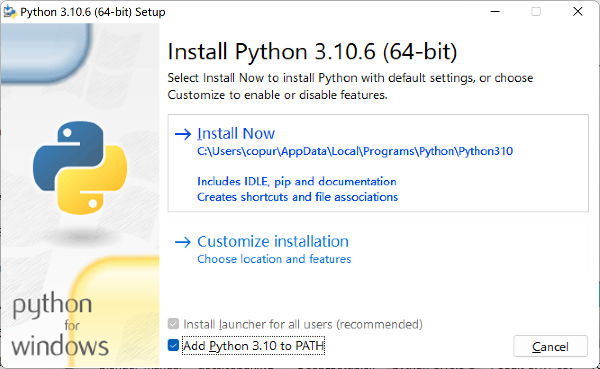

# blender中文翻译贡献教程

## 前言

因为blender cn社区的老教程已经过时许久，可能会导致不少问题，故此写一份新的版本

主要内容参考[blender docs](https://docs.blender.org/manual/zh-hans/3.4/contribute/index.html)以及[blender cn 老教程](https://www.jianshu.com/p/b1a48105e05c)

本教程主要针对Windows下，Mac&Linux平台建议参考官方文档

## 安装依赖软件

`blender docs`依赖Python进行文档编译以及SVN进行版本管理，故需先安装这两个程序

###　安装Python

可先前往[官方下载](https://www.python.org/downloads/)页面下载Python

本人使用的是3.10.6版本，记得勾选`Add to Path`



### 安装SVN

SVN管理，官方建议Windows下使用的是[TortoiseSVN](https://tortoisesvn.net/downloads.html)

选择对应系统版本的下载即可


最好勾选`Command line client tools`，会在后续较为方便使用

### 下载文档源码

安装完成后新建一个空文件夹，推荐命名为`blender_docs`

随后在此处右键，点击checkout..


在URL of repository中填入`https://svn.blender.org/svnroot/bf-manual/trunk/blender_docs`

Checkout of directory中理论上就是刚才新建的空文件夹，直接点击ok即可，等待一杯咖啡的时间

倘若速度较慢可以在TortoiseSVN设置 -> Network中启用代理，在此不多做解释


下载完毕后，进入刚才的文件夹右键打开终端（也有可能需要按住`Shift`键再右键）

输入`pip install -r requirements.txt`并回车执行安装所需依赖

倘若一切顺利便会显示

```bash
Successfully installed Jinja2 MarkupSafe Pygments Sphinx docutils sphinx-rtd-theme Cleaning up...`
```

因为笔者已经安装完成故没有截图

时不时运行

```bash
pip install -r requirements.txt --upgrade
```

确保依赖为最新

不要关闭终端，后续还需使用

## 下载中文翻译&编译文档

### 编译文档

在刚才的命令行窗口内输入

```powershell
.\make
```

开始编译

第一次编译以及较大的更改相对耗时较久


编译成功后会打开页面


也可以直接浏览目录下的`build\html`文件夹

不要关闭终端

### 下载中文翻译

在终端内输入

```bash
svn checkout https://svn.blender.org/svnroot/bf-manual-translations/trunk/blender_docs/locale/zh-hans locale/zh-hans
```

此时会在`locale\zh-hans\LC_MESSAGES`下得到两个po文件


### 编译中文手册

执行

```bash
sphinx-build -b html -D language=zh manual/ build/zhhtml
```

编译完成后的页面在`build\zhhtml`下


双击index.html即可开始阅读

### 编辑po文件

官方推荐的po编辑器为[Poedit](https://poedit.net/)

但在笔者实际使用的过程中，Poedit会大量合并行，导致最终的提交超过许可的大小，故在本方案中，推荐使用[VSCode](https://code.visualstudio.com/)进行编辑工作

下载VSCode并打开`blender_manual.po`文件

通常会直接提示安装插件，若没有提示可手动查找


可通过搜索快速定位到需要翻译的片段

在`msgstr`右侧的字符串中输入翻译的结果，遵循markdown规范

一些注意点及标准可参考[blender cn 老教程](https://www.jianshu.com/p/b1a48105e05c)

`#, fuzzy`表示该段翻译需要修改

确保不要更改该文件的编码，并保持换行格式等正常

### 翻译参考工具推荐

个人推荐使用[DeepL](https://www.deepl.com/)作为翻译参考工具，相较其他翻译软件对专业术语有着更好的支持，此外，其客户端支持快速翻译文本的功能


## 提交工作

在完成翻译并确保保存之后，可以通过patch的方式进行提交

右键修改的文件


选择Create patch

如果Create Patch没有显示在菜单内，可以进入设置勾选


接着会出现如图所示窗口，选择OK


接着选择保存文件到你知道的目录

前往[https://developer.blender.org/differential/diff/create/](https://developer.blender.org/differential/diff/create/)提交patch文件

倘若没有账号需要注册一个


`Raw Diff`直接粘贴patch文件内容

`Raw Diff From File`选择刚才导出的patch文件

`Repository`选择`rBMT Blender Mannual Translations`

然后点击Create Diff


点击Continue


Title为更改赋予标题

Summary输入更改的概要

Reviewers与Subscribers通过搜索`yuzukyo`选择`xueke pei`

Repository选择`rBMT Blender Mannual Translations`

Tags选择Translations

接着点击Create New Revision

接下来等待审核通过即可

此外，也可以直接申请官方提交权限进行提交


## 后记

​		blender是一个社区驱动的开源软件，其进步与维护工作依赖社区完成，也因此可能会出现有的部分进度严重落后的情况，截止笔者更新时，blender中文文档的大量片段仍为英文，大大干扰了文档的可阅读性，也不利于必要时查阅文档，在此由衷地期望各位能够参与到文档翻译或者其他blender贡献工作中来，为社区的发展添光添彩。