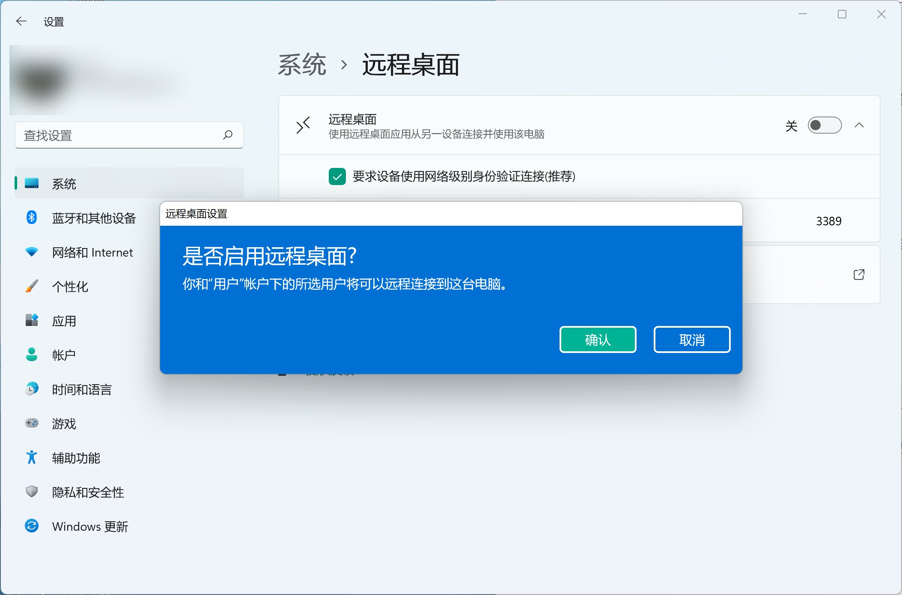
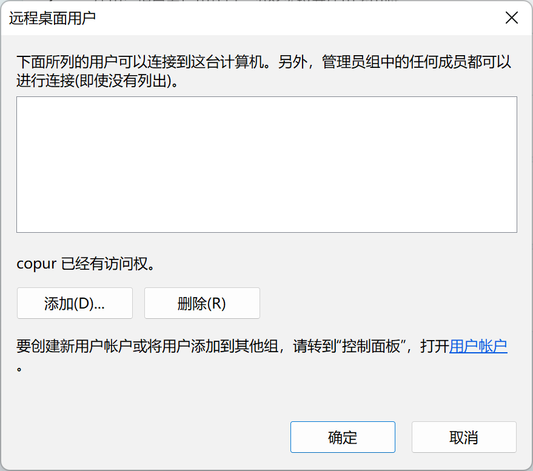
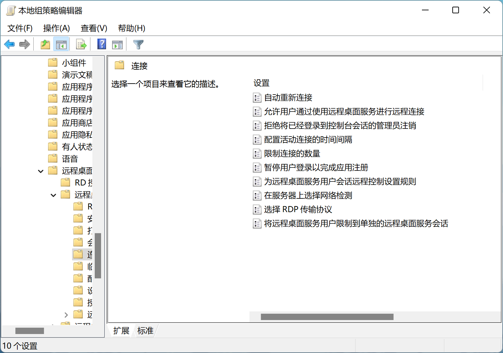
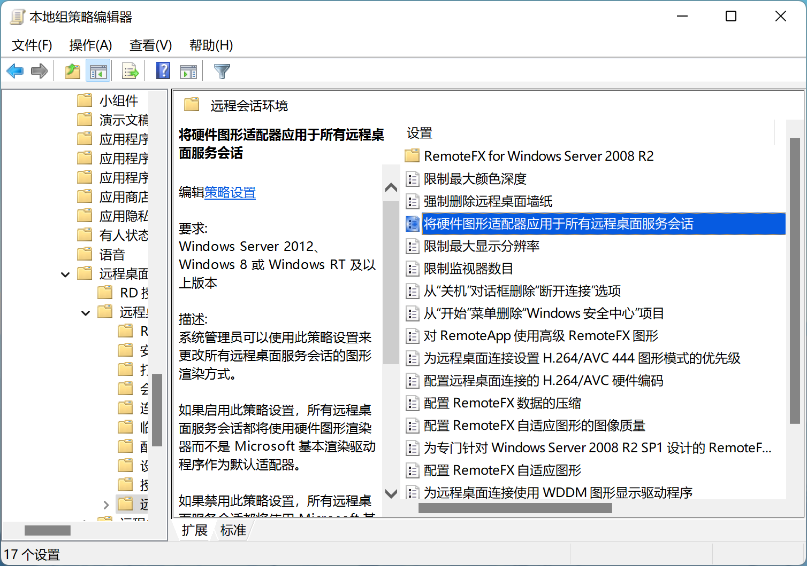
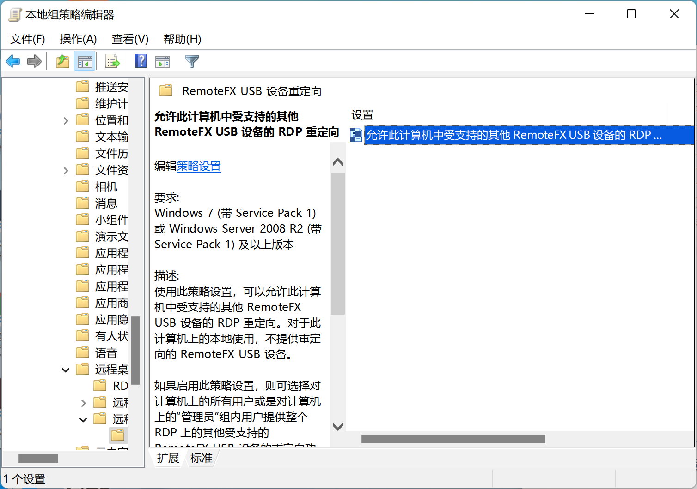

# 远程桌面服务配置的部分记录

因工作学习需要，最近和室友合资购入了一台电脑，为便于使用进行rdp的配置

## RDP补全升级

使用[SuperRDP2](https://www.hankeer.org/article/superrdp2.html)对Windows版本进行补全

同时后续的组策略相关内容，建议使用专业版

原本参考使用的是[RDPWrap](https://github.com/stascorp/rdpwrap)，但因为RDPWrap已经年久失修，且无法及时适配新版版本，使用面有限

<!-- more -->

SuperRDP2主要功能

1. 拉去线上最新配置信息，自动重装
2. 实时检查远程桌面开启状态
3. **高级功能：自动分析** 1）支持自动分析未支持版本，自动支持。 2）系统升级后自动分析支持新版本（开启自动分析、开机启动）
4. 备份当前配置到SuperRDP2目录并分享到GitHub

其中自动分析需要使用作者的公众号获取代码开启

## 开启远程桌面

> 请确保使用的是Windows专业版（或更完整版本）或者已经通过SuperRDP2进行补全

通过点击设置 -> 远程桌面



随后点击下方的`远程桌面用户`添加能加入远程桌面的用户



## 调整组策略

> 本章节需要服务端为专业版或更完整版本

`Win+R` 打开运行，输入`gpedit.msc`，打开本地组策略编辑器，依次选择[计算机配置] --> [管理模板] --> [Windows组件] --> [远程桌面服务] --> [远程会话主机] --> [连接]

调整如下组策略

1. 启用“限制连接的数量”，根据自己需要设置数量实现多用户登录

2. 启用“将远程桌面服务用户限制到单独的远程桌面服务会话”，避免一个用户出现多次连接导致部分程序无法找到



返回上一级，选择远程会话环境

调整如下组策略

- 启用“将硬件图形适配器应用于所有远程桌面服务会话”以使用硬件加速

可以下载[nvidia-opengl-rdp](https://developer.nvidia.com/nvidia-opengl-rdp)以启用n卡的硬件加速

此处可以根据需要调整更多组策略以适应需求



可在用户机的组策略

[计算机配置] --> [管理模板] --> [Windows组件] --> [远程桌面服务] --> [远程桌面连接客户端] --> [RemoteFX USB设备重定向]

启用“允许此计算机中手指操的其他RemoteFX USB 设备的RDP重定向”

从而在rdp中使用本地u盘



## 外部访问设置

远程桌面连接默认只能在局域网内使用，所以需要特殊配置从外连接

### IPv6

由于拥有公网IPv6，所以使用相对简单，经过选择后决定使用[ddns-go](https://github.com/jeessy2/ddns-go)将ip固定到域名

因为是Windows，所以只能使用`系统中使用`的方案

下载并解压https://github.com/jeessy2/ddns-go/releases

双击运行程序将自动打开[http://127.0.0.1:9876](http://127.0.0.1:9876/)指导配置

以管理员身份运行`.\ddns-go.exe -s install`可以将ddns-go作为服务安装

因为使用的是IPv6，所以需要在设置界面中打开IPv6

钉钉机器人配置:

- 钉钉电脑端 -> 群设置 -> 智能群助手 -> 添加机器人 -> 自定义
- 只勾选 `自定义关键词`, 输入的关键字必须包含在RequestBody的content中, 如：`你的公网IP变了`
- URL中输入钉钉给你的 `Webhook地址`
- RequestBody中输入 `{"msgtype": "markdown","markdown": {"title":"你的公网IP变了","text": "#### 你的公网IP变了 \n - IPV6地址：#{ipv6Addr} \n - 域名更新结果：#{ipv6Result} \n - 域名结果：#{ipv6Domains} \n"}}`

### IPv4配置

因为本来就有一台服务器（内网穿透软件好贵😭），考虑之后使用自建[frp](https://github.com/fatedier/frp)

服务端使用Linux

```bash
wget https://github.com/fatedier/frp/releases/download/v0.43.0/frp_0.43.0_linux_amd64.tar.gz
tar -zxvf frp_0.43.0_linux_amd64.tar.gz
cd frp_0.43.0_linux_amd64/
mkdir -p /etc/frp
mv *.ini /etc/frp
mv frpc frps /usr/bin
```

新建`/usr/lib/systemd/system/frps.service:`

```ini
[Unit]
Description=Frp Server Service
After=network.target

[Service]
Type=simple
User=nobody
Restart=on-failure
RestartSec=5s
ExecStart=/usr/bin/frps -c /etc/frp/frps.ini
LimitNOFILE=1048576

[Install]
WantedBy=multi-user.target
```

```bash
systemctl enable frps
systemctl start frps
```

> 安全组需要同时放行7000和4433端口

客户端使用windows

下载并解压frp

frpc.ini

```ini
[common]
server_addr = 42.192.48.40
server_port = 7000

[rdp]
type = tcp
local_ip = 127.0.0.1
local_port = 3389
remote_port = 4433

[rdp_udp]
type = udp
local_ip = 127.0.0.1
local_port = 3389
remote_port = 4433
```

测试无碍后

使用[winsw](https://github.com/winsw/winsw)将frp作为服务启动

frpc.xml

```xml
<service>
    <id>frp</id>
    <name>frp</name>
    <description>frpc rdp服务</description>
    <executable>frpc</executable>
    <arguments>-c frpc.ini</arguments>
    <logmode>reset</logmode>
</service>
```

将`winsw.exe`、`frpc.xml`、`frpc.exe`、`frpc.ini`置于同一目录下

```powershell
.\winsw install frpc.xml
```

运行`services.msc`即可看到相关服务，可以进行登录账号等设置

> 如果出现rdp无法连接的情况，请检查rdp服务是否仍在正常运行

## 端口修改

> 修改端口后需要同时修改上面的frp服务配置

可在`HKEY_LOCAL_MACHINE\System\CurrentControlSet\Control\Terminal Server\WinStations\RDP-Tcp`处找到端口并修改

运行以下命令查看当前端口

```powershell
Get-ItemProperty -Path 'HKLM:\SYSTEM\CurrentControlSet\Control\Terminal Server\WinStations\RDP-Tcp' -name "PortNumber"
```

运行以下命令将端口修改为4433

```powershell
$portvalue = 4433

Set-ItemProperty -Path 'HKLM:\SYSTEM\CurrentControlSet\Control\Terminal Server\WinStations\RDP-Tcp' -name "PortNumber" -Value $portvalue 

New-NetFirewallRule -DisplayName 'RDPPORTLatest-TCP-In' -Profile 'Public' -Direction Inbound -Action Allow -Protocol TCP -LocalPort $portvalue 
New-NetFirewallRule -DisplayName 'RDPPORTLatest-UDP-In' -Profile 'Public' -Direction Inbound -Action Allow -Protocol UDP -LocalPort $portvalue
```

